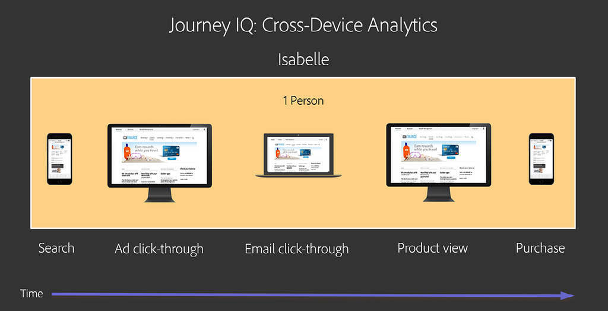
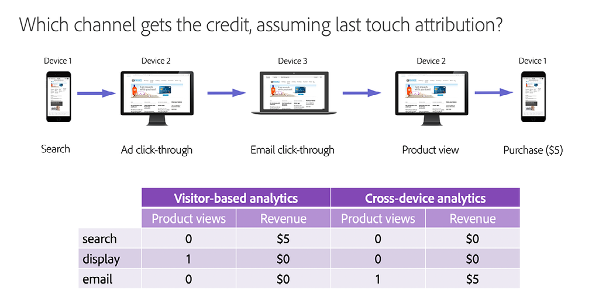

# Förstå och använda [!DNL Journey IQ] - Enhetsövergripande analys

När användarna interagerar med ert varumärke gör de det på många sätt och på flera enheter. Enhetsövergripande analys integreras med [!DNL Adobe Experience Platform Identity Service] för att identifiera hur enheter mappar till människor. Sedan används den här intelligensen för att skapa en helhetsbild av användarbeteendet. Detta leder till att det går att göra analyser på människor, inte på enheter.

## Översikt över enhetsövergripande analys

### Jag är inte mina enheter

När användare interagerar med ert varumärke gör de det på många sätt och på flera&quot;ytor&quot; eller&quot;enheter&quot;. De kan använda en webbläsare på en dator eller mobil enhet, eller använda en mobilapp. I traditionell digital analys, som växte upp i datainsamling som bygger på cookies, representeras var och en av dessa ytor som en unik&quot;besökare&quot;. Det innebär att var och en av era mänskliga användare representeras som en mängd unika besökare.

Här är ett exempel. Anta att Isabelle interagerade med ert varumärke på följande sätt:

*Isabelle är tre*

Med hjälp av traditionell analys delas Isabelles resa in i tre delar. Hon representeras som tre unika besökare, som var och en använde olika enheter för att utföra isolerade uppgifter. Det som behövs är en enhetlig vy över Isabelles interaktioner mellan olika enheter. [!DNL Journey IQ: Cross-Device Analytics] innehåller den här vyn.

*Isabelle är en*

### En enhetsövergripande vy ger bättre analys

En personcentrerad, enhetsövergripande vy av Isabelles beteende kan göra stor skillnad i din analys. Det traditionella besöksbaserade tillvägagångssättet ger er till exempel inte en fullständig bild av hur effektiva era marknadsföringskanaler är. Låt oss titta på Isabelles resa en gång till och fokusera på vilken kanal som får beröm för sin produktvy och för sitt köp. Vi kommer att använda [!UICONTROL last-touch]-attribuering för enkelhet, men samma problem uppstår när du använder en attribueringsmodell när du delar upp Isabelles beteende i separata besökare. Med hjälp av den traditionella besökarbaserade vyn av världen får du mycket olika, till och med vilseledande resultat:

*Traditionell analys jämfört med attribuering i*

Observera att e-postkanalen i vyn över olika enheter får beröm för både produktvyn och köpet, vilket bättre motsvarar Isabelles verkliga upplevelse.

Läs mer om:

* Så här fungerar [!DNL Cross-Device Analytics]
* Krav för [!DNL Cross-Device Analytics]
* Tolka enhetsövergripande data
* Analysera enhetsövergripande data i Analysis Workspace

## Så här fungerar [!DNL Cross-Device Analytics]

[!DNL Journey IQ: Cross-Device Analytics (CDA)] integreras med  [!DNL Adobe Experience Platform Identity Service]och använder antingen  [[!DNL Co-op Graph]](https://docs.adobe.com/content/help/en/device-co-op/using/home.html) eller  [!DNL Private Graph] för att identifiera hur enheter mappar till människor. Sedan används den här intelligensen för att skapa en helhetsbild av användarbeteendet. CDA innehåller oöverträffade funktioner och verktyg som hjälper ert företag att förstå användningen av flera enheter och kundupplevelsen i alla dessa enheter i deras interaktioner med ert varumärke. Det placeras som ett lager under Analysis Workspace för att ge djupgående insikter i personbaserad målgruppsanalys och enhetsövergripande attribuering, segmentering och reseanalys med hjälp av kraftfulla verktyg som [!UICONTROL Fallout], [!DNL Flow], [!DNL Cohort], [!DNL Segment IQ] och [!DNL Attribution IQ].

### [!DNL Cross-Device Virtual Report Suite]

CDA presenteras via en särskild typ av korsenhetsövergripande [[!UICONTROL Virtual Report Suite]](https://docs.adobe.com/content/help/en/analytics/components/virtual-report-suites/vrs-about.html). På så sätt kan ni fortsätta att använda den ursprungliga enhetsbaserade rapportsviten när ni lägger in enhetsövergripande analyser i organisationen. Det är enkelt att konfigurera ett CDA VRS.

I steg ett av VRS-byggarna väljer du [!UICONTROL report suite] som har konfigurerats av Adobe som CDA-aktiverat:

*Välj en CDA-aktiverad bas (källa)[!UICONTROL report suite]*
![[!UICONTROL Virtual Report Suite] steg ett](assets/cda-vrs-step-one.png)

Aktivera sedan [!UICONTROL Report Time Processing] och aktivera [!UICONTROL cross-device stitching]:

*Aktivera  [!UICONTROL report-time processing] och[!UICONTROL cross-device stitching]*
![[!UICONTROL Virtual Report Suite] steg två](assets/cda-vrs-step-two.png)

Slutför konfigurationen av VRS och spara den. CDA VRS visas i Analysis Workspace med en speciell ikon bredvid:

*Välj CDA VRS i Analysis*
![[!UICONTROL Virtual Report Suite] WorkspaceSteg tre](assets/cda-vrs-step-three.png)

>[!TIP]
>
>Du kan skapa så många CDA [!UICONTROL virtual report suites] som du vill över den CDA-aktiverade basen [!UICONTROL report suite].

### Återställer historik

Ibland tar det en stund för dina användare att logga in och för [!DNL Co-op Graph] eller [!DNL Private Graph] att identifiera dem och mappa samman deras enheter. CDA använder ett 30-dagars summeringsfönster, vilket gör att en tidigare oidentifierad besökare kan återföras som en person upp till 30 dagar tidigare.

Hur hjälper det här? Återkalla Isabelles användarresa från diskussionen ovan:

![[!DNL Cross-Device Analytics] Resa](assets/cda-isabelle-journey-cross-device-analytics.png)

Det är möjligt att Isabelle inte loggade in förrän precis innan köpet gjordes, och att [!DNL Co-op Graph] eller [!DNL Private Graph] inte mappade samman Isabelles enheter förrän någon gång efter köpet. Men CDA:s 30-dagars summering gör det möjligt för CDA att återuppliva Isabelles tidigare beteende på personnivå, vilket ger dig en helhetsbild av den resa du behöver.

>[!NOTE]
>
>Eftersom historiken kan återställas innebär det att dina data kan ändras över tiden i en CDA-aktiverad [!UICONTROL virtual report suite]. Tänk på detta när ni förmedlar insikter från en CDA-baserad analys.

## Krav för [!UICONTROL Cross-Device Analytics]

CDA ingår i [[!DNL Analytics Ultimate]](https://helpx.adobe.com/legal/product-descriptions/adobe-analytics.html). Från och med september 2019 är [!DNL Analytics Ultimate]-kunder som uppfyller villkoren nedan berättigade att använda CDA. Kraven för CDA är följande:

* Ditt företag måste vara medlem i [!DNL Adobe Experience Platform Identity Service] [[!DNL Co-op Graph]](https://docs.adobe.com/content/help/en/device-co-op/using/home.html) eller använda en [!DNL Adobe Experience Platform Identity Service Private Graph].
* Du måste implementera allt som krävs för [!DNL Co-op Graph] eller [!DNL Private Graph] inklusive [Experience Cloud ID (ECID)](https://docs.adobe.com/content/help/en/id-service/using/home.html) och ID-synkronisering med diagrammet. Observera att förutom tekniska krav har [!DNL Co-op Graph] andra rättsliga och avtalsmässiga krav.
* Det går för närvarande inte att använda två IMS-organ med en enda [!DNL Private Graph], så du måste standardisera med en enda IMS-organisation. I vissa fall kan en kund med flera IMS-organ använda [!DNL Co-op Graph] tillsammans med CDA.
* [!DNL Co-op graph] och [!DNL Private Graph], samt vissa komponenter i CDA finns i [!DNL Microsoft Azure]. Det innebär att [!DNL Analytics]-data kopieras fram och tillbaka mellan Adobe databehandlingscenter och Adobe presence i [!DNL Microsoft Azure]. Vissa [!DNL Analytics]-data kommer att lagras i [!DNL Azure]. Ditt företag måste godkänna detta avtal.
* CDA kräver en &quot;cross-device&quot; [!UICONTROL report suite]. Det innebär att den [!UICONTROL report suite] som du använder för CDA måste innehålla data från flera olika enhetstyper eller&quot;ytor&quot;, till exempel datorwebben, mobilwebben och mobilappar. Från och med september 2019 måste serveranropsvolymen för denna [!UICONTROL report suite] vara 100 MM serveranrop/dag eller mindre. (Gränserna för antalet samtal på servern kommer att öka under de närmaste månaderna.)
* Från och med september 2019 är [!DNL Co-op Graph] och [!DNL Private Graph] endast tillgängliga i Nordamerika. Schemat för närvaro av diagram i EMEA och APAC kommer att tillkännages vid en senare tidpunkt. Om du befinner dig i dessa områden rekommenderar vi att du börjar titta på dessa förutsättningar nu så att du är redo att gå när diagrammet blir tillgängligt.

## Tolka enhetsövergripande data

### Personer som inte är besökare

I CDA [!UICONTROL Virtual Report Suite] ser du några ändringar. Måttet [!UICONTROL Unique Visitors] ersätts med två nya mått: [!UICONTROL People] och [!UICONTROL Unique Devices]. Dessa nya mätvärden ger er bättre insikt i målgruppens storlek.

*Personer och unika*
![enheterCDA  [!UICONTROL People Metric]](assets/cda-people-metric.png)

I [[!UICONTROL Segment Builder]](https://docs.adobe.com/content/help/en/analytics/components/segmentation/segmentation-workflow/seg-build.html) har segmentbehållaren [!UICONTROL Visitor] ersatts av en [!UICONTROL Person]-segmentbehållare. Med ett CDA VRS kan du skapa enhetsövergripande segment som:

* Personer som använder mer än en enhet
* Personer som påbörjar sin resa på en mobil enhet och sedan köper den på en stationär enhet
* Besök där personer använder mer än en enhet för att utföra en uppgift

*Personnivåsegment*
![[!DNL Segment Builder] [!UICONTROL Person] Container](assets/cda-segment-builder-person-container.png)

### Dimensionens beständighet

Inom ett CDA VRS finns nu dimensioner som [!DNL eVars] automatiskt kvar på alla enheter. En [!DNL eVar] som är konfigurerad som:

* Allokering: Senaste (senaste)
* Upphör att gälla efter: Inköp

kommer nu att finnas kvar automatiskt från en enhet till en annan tills köphändelsen aktiveras.

## Analysera enhetsövergripande data i Analysis Workspace

### Personbaserad målgruppsanalys

Har du någonsin undrat hur många som interagerar med ert varumärke? Har du velat förstå hur många och vilka typer av enheter de använder? Hur överlappar användningen dem? Med ett CDA VRS kan du skapa [Venndiagram](https://docs.adobe.com/content/help/en/analytics/analyze/analysis-workspace/visualizations/venn.html) och devices-per-person [histogram](https://docs.adobe.com/content/help/en/analytics/analyze/analysis-workspace/visualizations/histogram.html).

*Personbaserad*

### Enhetsövergripande [!DNL Flow]

Med CDA och Analysis Workspace kan du visualisera hur personer flyttar från en enhet till en annan över tid i [[!DNL Flow visualization]](https://docs.adobe.com/content/help/en/analytics/analyze/analysis-workspace/visualizations/flow/flow.html). Du kan se var de lämnar sin resa och var de fortsätter.

*[!DNL Flow]med CDA*
![[!DNL Flow Visualization]](assets/cda-flow-viz.png)

### Enhetsövergripande [!DNL Fallout]

Du kan använda flera [[!DNL Fallout visualizations]](https://docs.adobe.com/content/help/en/analytics/analyze/analysis-workspace/visualizations/fallout/fallout-flow.html) för att analysera hur väl användarna gör det genom en viss serie steg innan du lyckas. Visste du att din syn på dessa [!DNL Fallout visualizations] är begränsad när du använder traditionell enhetsbaserad analys? För att lyckas med genomgången måste nästa steg göras i samma webbläsare eller app som föregående steg. I enhetsbaserad analys är ni blinda för personer som lyckats slutföra nästa steg på en annan enhet.

Oroa dig inte, CDA har er täckt. CDA skapar vyn för olika enheter som gör [!DNL Fallout visualizations] mycket, mycket mer användbart. Det som verkligen betyder något är om personen till slut lyckades med sin uppgift någonstans.

*[!DNL Fallout]med CDA*
![[!DNL Fallout Visualization]](assets/cda-fallout-viz.png)

### [!DNL Cross-Device Attribution IQ]

Eftersom CDA skapar ett lager med data mellan olika enheter under Analysis Workspace, kommer all analys att smakas med ett enhetsperspektiv. Ett kraftfullt exempel är via [[!DNL Attribution IQ]](https://docs.adobe.com/content/help/en/analytics/analyze/analysis-workspace/panels/attribution/attribution.html). [!DNL Attribution IQ] i Analysis Workspace kan du jämföra flera attribueringsmodeller sida vid sida. Genom att använda den här funktionen med CDA kan du nu jämföra hur olika enheter bidrar till framgång.

Anta till exempel att du vill förstå hur ofta en mobiltelefon är den första enheten som används i en interaktion som leder till framgång. Detta representerar mobiltelefonens&quot;förvärvsfrekvens&quot;. Med CDA + [!DNL Attribution IQ] kan du göra den här analysen:

*[!DNL Attribution IQ]med CDA*
![[!DNL Attribution IQ]](assets/cda-attribution-iq.png)

Mer information finns i [[!DNL Cross-Device Analytics] hjälpdokumentationen](https://docs.adobe.com/content/help/en/analytics/components/cda/cda-home.html).
