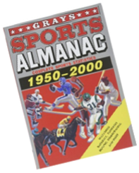

# Om Adobe Analytics Attribution Panel &amp; Lookback Windows

Lär dig hur du använder panelen Attribution och Lookback Window för att förstå kundbeteenden och anpassa hur dimensionsobjekt får kredit för lyckade händelser.

## Använda panelen Attribution

&#39;Great Scott!&#39;

Så snart jag tänkte på [Attributionspanel](https://experienceleague.adobe.com/docs/analytics-platform/using/cja-workspace/panels/attribution.html) och **Fönstret Lookback**, fick jag en påminnelse om låten &quot;Back in Time&quot; av Huey Lewis och News, Sedan påmindes jag förstås också om att vårt typiska svar på många nya verktyg som dessa är att bara skjuta upp användningen eftersom de ser så komplicerade ut.

Jag menar verkligen, titta bara på alla alternativ, växlar, paneler, avläsningar och knappar.  Och seriöst, låt oss prata om den där fluxkondensatorn.  Sa jag bara en flux kondensator?

OK, jag medger **Attributionspanel** är ett ganska komplext verktyg, Men vårt typiska jobb som analytiker, dag in och dag ut, är att använda ett mycket komplext verktyg för att se vad som har hänt tidigare.  Verktyget kallas **Adobe Analytics**!

Därför, varför skulle vi låta något som en liten rädsla stå i vägen för ett så häftigt och kraftfullt verktyg som gör att vi bokstavligen kan se bakåt i tiden varje dag?

Vi handlar om det där, eller hur?  ELLER HUR?! (Jag menar, kom igen, jag är ganska säker på att det fortfarande är okej och &quot;politiskt korrekt&quot; att kalla oss geeks?)

Vem bryr sig?  Ryck upp dig, Geeks, Nerds, Goobers, Dweebs och Techies (ja till och med Trekkies), jag hör bilstereon nu:

&quot;Så ta mig härifrån, jag har inget emot det!  Men det är bäst att du lovar mig.. Jag kommer tillbaka i tid!&quot;

Jag har din uppmärksamhet nu, eller hur?  Bra!

Vi bryter ner lite.  Nu när vi alla är glada över **tidsresor**, tar vi ett steg tillbaka och ser vad **Attributionspanel** är:

Nej, nej, nej, nej!  Låt oss inte bli distraherade än.  Vi kanske försöker igen:

I **Attribut** Tänk bara på hur händelser/händelser kan orsakas av en individ, av flera personer eller av en eller flera olika saker.

Enligt [Adobe](https://experienceleague.adobe.com/docs/analytics-platform/using/cja-dataviews/component-settings/attribution.html), ger attribuering analytiker möjlighet att anpassa hur dimensionsposter får kredit för lyckade händelser.  Faktum är att ingen given kundresa någonsin är helt linjär och mindre förutsägbar.  Dessutom kommer varje kund att fortsätta i sin egen takt. ofta kan de fördubbla, stoppa, släppa ut eller engagera sig i andra icke-linjära beteenden. Dessa organiska åtgärder gör det svårt eller praktiskt taget omöjligt att veta hur marknadsföringssatsningarna påverkar hela kundresan. Det hämmar också arbetet med att knyta samman olika datakanaler.

Känner du till något av detta?  Tänk på det i samband med Marty McFly&#39;s resa:

Från den punkt då han flydde från Tvillingpines Mall-parkeringen till den tidpunkt då han bokstavligen slängde ut sig ur DeLorean innan den förskingrades av en 210-tonslinga verkar långt ifrån linjär, och det är ingenting någon kunde ha förutsett.

Men med hjälp av filmmagin kan vi följa Martys väg genom tiden och förstå alla hans kontaktytor, hans bollar, dubbelrygg och bortfall.

## Attributionsmodeller

I verkligheten kan vi använda **Attributionspanel** för att se flera olika saker.  Till exempel **Attributionsmodeller** visa oss hur **konverteringar** fördelas över **träffar** i en viss grupp.

Kort sagt, om tio personer trycker på en knapp för att gå genom en dörr, kommer våra attribueringsmodeller att tala om för oss vilken av dessa tio personer vi vill ge beröm för att ha tryckt på knappen.  Här följer några exempel på hur attribueringsmodellerna kan påverka dessa 10 personer:
* **Första beröring**: Den här är precis som den låter.  I det här fallet ger det 100 procent beröm till den första som gick genom dörren.  För detta är det troligare att marknadsförarna använder detta för taktik som sociala medier eller displayannonsering, men det är ofta en bra taktik för produktrekommendationseffektivitet på plats.
* **Sista beröring**: Och precis som det låter.   Den här modellen ger 100 % beröm till den siste som gick in i dörren.  Den här modellen används ofta för att analysera saker som sökkampanjer och kampanjer med kort marknadsföringscykel.
* **Linjär**: Detta ger lika stor tilltro till alla som gick genom dörren.  Du får en DeLorean och får en DeLorean och en DeLorean.  ALLA FÅR EN DELOREAN!!
* **U-formad**: Den här ger 40 % av krediterna till den första i dörren, sprider 20 % av krediterna till alla däremellan och ger sedan 40 % till den sista genom.  Tänk på en situation där du vill känna igen de flesta konverteringar både på fram- och baksidan, men också vill dra ihop en liten del av krediten över några av de medverkande interaktionerna däremellan.
* **Tidsminskning**: Jag skulle bli missad om jag inte delade den här med dig innan jag skickar ut dig till den officiella dokumentationen för att granska de återstående modellerna.  Precis som Doc Browns plutonium har den här modellen bokstavligen en halveringstid som sjunker exponentiellt!  I det här fallet är standardparametern för den här modellens halveringstid 7 dagar.  Det sätt det fungerar på är att sedan lägga vikt på varje marknadsföringskanal, baserat på den tid som går efter den första kontaktytan och när kunden konverterar.

Mer information om detta och om återstående **Attributionsmodeller**, [klicka här](https://experienceleague.adobe.com/docs/analytics/analyze/analysis-workspace/attribution/models.html).

För att göra detta ännu intressantare ska vi prata om **Sökfönster**.

Nu kör vi tillbaka i tid!  För här börjar det roliga!

Adobe definierar **Sökfönster** som&quot;hur lång tid en konvertering ska ta tillbaka för att inkludera beröringspunkter. Attributionsmodeller som ger större tilltro till första interaktioner ser större skillnader när du tittar på olika uppslagsfönster.&quot;

* **Besök uppslagsfönstret**: Går tillbaka till början av ett besök när en konvertering inträffar
* **Fönster för besökaruppslag**: Alla besök utförs fram till den 1:e i månaden av det aktuella datumintervallet.
* **Anpassat uppslagsfönster**: Gör att du kan expandera fönstret Attribution efter rapportens datumintervall upp till maximalt **90 dagar**.

Om du har sett ALL of the Back till Framtidens filmer vet du att Marty McFly gick tillbaka mer än en gång, och du vet också att han gick tillbaka till 1955 mer än en gång.  Om vi använder inköpen av &quot;Gray&#39;s Sports Almanac&quot; som konverteringsevent bör du tänka på följande:

1. Lite innan **1:30 am** på **26 oktober 1985** går Marty McFly tillbaka i tiden till **5 november 1955**, där han först springer över ett pinjeträd i en tidsresa DeLorean.  Under nästa och en halv vecka interagerar han med ett flertal människor, inklusive hans föräldrar, vilket i slutänden påverkar framtiden genom att påverka hans pappa till att stå upp för en mobbning vid namn Biff, så att hans pappa kan förverkliga sin egen potential att bli en framgångsrik författare till science-fiction.
1. Senare samma morgon **26 oktober 1985** Doktor Emmett Brown kommer på Marty McFly&#39;s uppfartsväg för att informera honom och hans flickvän om att något har gått fruktansvärt fel med deras barn och de måste skynda sig till framtiden för att lösa sina problem.  Medan de åker, bevittnas deras avfärd av Biff, som tycker att det är konstigt att se en flygande DeLorean.  I framtiden, när Biff ännu en gång ser en flygande DeLorean och till och med senare får syn på &quot;två versioner&quot; av Marty, börjar han sätta ihop saker.   När han pratar om Doc Brown och Marty och argumenterar hur &quot;tidsmaskinen&quot; aldrig ska användas för personlig vinning och bara för forskning (eftersom Marty hade mullat över att ta en idrottsalmanacka tillbaka till det förgångna för att göra några personliga val), så stjäl Biff tidmaskinen medan de två är distraherade för att leverera sportalmanacet till sitt yngre jag förut.
1. Efter sin resa till framtiden återvänder Doc Brown och Marty till en **26 oktober 1985** de känner inte igen och de tar fram tidslinjerna som har ändrats av en ond biff.  De måste fixa det som hände, Doc och Marty återkommer till **12 november 1955**, den ödesdigra kvällen då allt ändrades av Marty när han besökte **1955**.  Doktorn och Marty räddar sista dagen genom att stjäla den sportmanac som Old Biff hade levererat till Young Biff i framtiden **1955**, men inte utan en helt ny twist måste du verkligen se filmernas hela trilogi för att verkligen njuta av och förstå.

Beroende på vår **Attributionsmodell** och **Fönstret Lookback** kan vi få några intressanta scenarier:

* Använda **första beröringen** och **besök uppslagsfönstret** attribueringen tittar på Martys besök där den senaste &quot;omvandlingen&quot; ägde rum, det vill säga när han och Doc lyckades stjäla sportalbmanalen från Young Biff och bibehålla sin motvilja mot stallgödsel.

* Tro det eller ej, med **första beröringen** och **besökarfönster**, skulle attribuering främja konverteringen där Biff i slutändan vinner.
* Använda en **linjärt uppslagsfönster** resulterar i en flerversell position där alla tidslinjer finns.  Det här är tyvärr inte **Marvel** eller **Star Trek**!

Och i det här skedet hoppas jag att du börjar få idén.

Så vad betyder allt det här för oss som analytiker?

The **Attributionspanel** och **Fönstret Lookback** ger oss möjlighet att titta bortom enkla data på ytnivå och fördjupa oss i kundresan. Genom att förstå vilka kontaktytor som haft störst effekt på konverteringarna kan vi fatta välgrundade beslut om våra marknadsföringsstrategier och fördela resurser mer effektivt.

Kom ihåg, när du har **Attributionsmodeller** och **Sökfönster** Om du väljer det här alternativet kan du fortfarande ändra dina data ytterligare genom att filtrera dem med ett segment eller någon annan komponent som du vill använda.  När panelen har renderats har du dessutom alla funktioner som finns i en traditionell **Arbetsyta**, vilket innebär att du har en officiell licens att köra 88 mph!

## Äntligen till övning

Nu när du har lagt ner idéerna kan du föreställa dig att du kör en marknadsföringskampanj och försöker avgöra vilken kanal som är mest effektiv för konverteringar. Med hjälp av **Attributionspanel** så ser du inte bara **Sista beröring**, men även **Första beröring**, **Samma beröring** och andra modeller du väljer för att avgöra vilka kanaler som är mest effektiva när det gäller att driva konverteringarna. Sedan kan den här informationen användas för att optimera era kampanjer och förbättra resultatet.

Nu när du har sett vad det kan göra, ska du inte skrämmas av de synbarligen komplexa funktionerna i **Attributionspanel**.  **Ansikte** den.  **Reparera** den.  **Förstå** den.  Det mesta av allt är att använda det till din fördel. The **Attributionspanel** och **Fönstret Lookback** är nyckeln till en djupare förståelse för era kunder och deras resa med ert varumärke.

Nu kan vi resa tillbaka i tiden med tillförsikt och använda styrkan hos vår pålitliga tidsmaskin (dvs.  **Adobe Analytics**) att fatta databaserade beslut, Och, viktigast av allt, kom ihåg: &quot;Vart vi ska, vi behöver inga vägar!&quot; (Bara en flytande kondensator och ett öga för attribuering!)

## Upphovsman

Det här dokumentet har skrivits av:

**Jeff Bloomer**, Manager, Digital Analytics på Kroger Personal Finance

Adobe Analytics Champion
