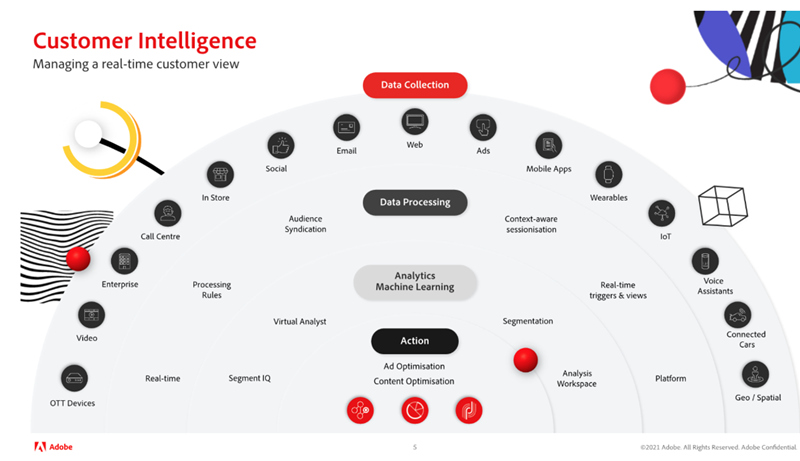

# Stärk kundanalysen med Virtual Analyst och Segment IQ i Adobe Analytics

I den här artikeln får du lära dig vikten av att använda artificiell intelligens och maskininlärning (AI/ML). Läs sedan om fördelarna och verkliga framgångar från globala kunder med hjälp av Virtual Analyst och Segment IQ för att upptäcka avvikelser, undvika avvikelser och maximera avkastningen.

## Värdet av artificiell intelligens

Du kanske minns den tid då schackmästaren Garry Kasparov besegrade av IBM® [!DNL Deep Blue]. Experterna övertygade om att en maskin inte kunde slå mänskligt beslutsfattande och omdöme i ett spel som är så komplext som schack. Men det gjordes, och det var avgörande för en genomgripande förändring av affärsstrategin och den tekniska innovationen i takt med att kraften i artificiell intelligens avslöjades.

Adobe Analytics är det centrala systemet för intelligens för upplevelseföretag, vilket gör det möjligt för alla i företaget att förstå och optimera kundinteraktioner med sitt varumärke över alla kontaktytor i realtid och i stor skala.

Adobe verktyg är inte här för att ersätta dig, utan för att du ska få maximal avkastning på dina satsningar.

## Omvandla era analyser

För att utveckla era analyser måste vi fokusera på tre viktiga saker:

1. Organisation - Så här skapar du en helhetssyn på kunderna, prioriterar insiktsdrivna beslut och demokratiserar data.

1. Teknik - Så här ser du till att data och teknik levererar personalisering i stor skala.

1. Kunden - Hur man bygger upp förtroende och anpassar sig till förändringar.

Analyserna är utmanande och tidskrävande, men det finns ett ständigt behov av att snabba upp time-to-insight. Viktiga problem som organisationer står inför är:

* Begränsade organisationsresurser - olika affärsmål kan begränsa resurstillgängligheten
* Begränsad teknisk expertis - kan kunskap delas och data demokratiseras
* Kundernas förväntningar - kan ert team reagera dynamiskt på förändringar i kundbeteenden?

## Förstå kundanalys med Virtual Assistant, som drivs av Adobe Sensei

### 3 Nivåer av kundanalys

När det gäller en framgångsrik strategi för kundanalys måste vi gå igenom tre nivåer (se bild 1 ovan), från a) datainsamling till b) databearbetning till c) analys och maskininlärning, innan vi äntligen kan vidta åtgärder och optimera vårt innehåll och våra annonser.

1. Datainsamlingen är beroende av din organisation och kan omfatta olika kanaler och medier. Dessa omfattar OTT-enheter, video, företag, callcenters, in-store, social email, web, ads, mobile apps, wearables, IoT, voice assistants, connected cards, och geo/spatial.

1. Databearbetningen innefattar datainsamling i realtid, bearbetningsregler, målgruppssyndikering, sammanhangsberoende sessioner, triggers och vyer i realtid samt plattform.

1. Analyser och maskininlärning omfattar segmentanalys, virtuell analytiker, segmentering, Analysis Workspace

### Utnyttja er virtuella analytiker

Tänk på [Virtual Analyst](https://experienceleague.adobe.com/docs/analytics/analyze/analysis-workspace/virtual-analyst/overview.html?lang=en) som rockstjärnsanalytiker som:

* Lämna aldrig kontoret och behöver inte
* Talar om vem, när, var, varför och så.
* Agerar direkt på intelligenta aviseringar från avvikelseövervakning dygnet runt över alla data
* Det går att ändra huvudkomponenterna för [!UICONTROL Analysis Workspace]

### Upptäck dolda möjligheter

* Få aktuell insyn i status för nyckeltal för marknadsföring
* Gör bra marknadsföringsinvesteringar tillförlitligt och förutsägbart
* Håll jämna steg med och uppfylla/överträffa kundernas förväntningar

### Verklig framgång

Den virtuella analytikern avslöjade följande scenarier för verkliga Adobe-kunder:

* Uppsägning av kampanj - 1,7 miljoner USD i daglig intäktsökning som huvudsakligen bygger på en kampanj som avslutats i förtid.
* Leverantörsfel - 73 % ökning av kundvagnsborttagningar på grund av ett tagghanteringsfel som automatiskt tog bort vissa produkter från vagnen.
* Problem med webbläsare - 8 % ökning av antalet övergivna varukorgar i Chrome webbläsare. Korrigeringen resulterade i en daglig intäktsökning på 1,2 miljoner USD.
* Kupongbedrägeri - har upptäckt en ökning på 81 % av beställningarna som orsakas av trafik som hänvisas till av två stora dagliga affärer/kuponger som främjar bedrägliga toalettkuponger. Dessa beställningar kunde avbrytas.
* Företagsspionage - 200 % ökning av antalet besök orsakade av robotar/crawler skapade av deras huvudkonkurrent för att skrapa bort innehåll från deras sajt för återanvändning. Dessa IP-adresser kunde blockeras.

## Adobe Analytics

[Analysidentifiering](https://experienceleague.adobe.com/docs/analytics/analyze/analysis-workspace/virtual-analyst/anomaly-detection/anomaly-detection.html?lang=en):

* Använd inbyggda prediktiva algoritmer för att identifiera toppar och dalar i era data som ni inte visste fanns.
* Använd 28 unika algoritmer för att identifiera avvikelser, bland annat säsongsvariationer, tillväxt och cykliska modeller samt semesterjustering.
* Minska beroendet av datavetare och frigöra medborgardatavetare.

[Bidragsanalys](https://experienceleague.adobe.com/docs/analytics/analyze/analysis-workspace/virtual-analyst/contribution-analysis/ca-tokens.html?lang=en):

* Identifiera snabbt bidragande faktorer som har orsakat betydande förändringar i era data.
* Spara massor av timmar på att söka efter förklaringar till förändringar i mätvärden.
* Utnyttja kraftfull maskininlärning som utformats för att omvandla analytiker och marknadsförare till datavetare.

[Intelligenta aviseringar](https://experienceleague.adobe.com/docs/analytics/analyze/analysis-workspace/virtual-analyst/intelligent-alerts/intellligent-alerts.html?lang=en):

Håll dig informerad om dataavvikelser hela tiden - oavsett om du är på kontoret eller på resande fot

* Skapa aviseringar direkt från Analysis Workspace
* Basregler för avvikelser (90 %, 95 %, 99 %), % förändring och över/under
* Använd [!UICONTROL Alert Preview] för att se hur ofta en varning skulle ha utlösts
* Utnyttja stödet för SMS och e-post med länkar till autogenererade [Analysis Workspace](https://experienceleague.adobe.com/docs/analytics/analyze/analysis-workspace/home.html?lang=en)-projekt

[Segment-IQ](https://experienceleague.adobe.com/docs/analytics/analyze/analysis-workspace/segment-iq.html?lang=en):

* Upptäck skillnaderna och överlappningarna mellan era segment för att informera er segmenteringsstrategi
* Identifiera viktiga egenskaper hos de målgruppssegment som driver era nyckeltal
* Få rapporter och visualiseringar på några sekunder till minuter som visar gemensamma värden över dimensioner, mätvärden och andra segment
* Förbättra engagemanget med värdefulla kunder

## Framgångsrik i verkligheten med segmentanalys

**Mobil eller dator:**&quot;Vi jämförde träffar från en av våra webbplatser till en annan webbplats och hittade snabbt en mängd inkonsekvenser i taggningen.&quot; → Undvik dataproblem före en produktrelease

**Funktionsanvändning:**&quot;Kunder som använde vår produktjämförelsefunktion var 10 % mer benägna att konvertera. Att flytta det överst på sidan ökade beställningarna.&quot; → 4% ökning av konvertering

**Innehållsengagemang:**&quot;Vi upptäckte att det var dubbelt så troligt att besökare i vår nyhetssektion tittade på videoannonser, så vi har lagt till fler videoalternativ i den delen.&quot; → 7 % ökning av antalet visade videoannonser

**Betald sökning:** &quot;Besökare som kommer från sökmotorer var mer benägna att mersälja än tre gånger. Till följd av detta ökade vi våra utgifter för specifika nyckelord.&quot; → 56 % merförsäljning

**Produkttestyp:**&quot;Personer som köper Fitbit har sex gånger större chans att få &quot;slut på lager&quot; än alla andra, så vi beställde snabbt fler Fitbit.&quot; → Produkterna kan inte köpas och fler ledighetsbeställningar kan göras

Titta på vårt [webbinarium](https://adobecustomersuccess.adobeconnect.com/pmetho6ivh68/) om du vill ha mer information.

Läs mer om strategi och tankeledarskap på navet [Nöjda kunder](https://experienceleague.adobe.com/docs/customer-success/customer-success/overview.html).